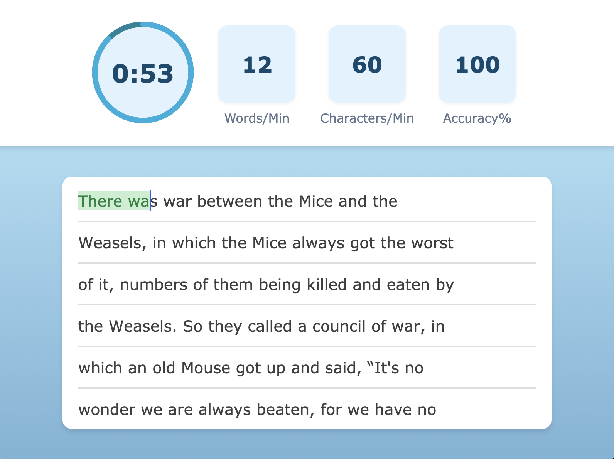

# Typing Speed Test

Built with React and Vite. HTML, CSS, and JavaScript are included.

## Quick View

[View Typing Speed Test On Vercel](https://typing-speed-test-roan-six.vercel.app)

## Features

- Live typing statistics
- Dynamic text rendering
- Screen reader accessibility

## Preview



## Getting Started

1. Clone the repo:
   ```bash
   git clone https://github.com/SilentViewer807/Typing-Speed-Test.git
   ```
2. Navigate to the project directory:
   ```bash
   cd Typing-Speed-Test
   ```
3. Install dependencies:
   ```bash
   npm install
   ```
4. Run the development server:
   ```bash
   npm run dev
   ```

## License

This project is open source and available under the MIT License.
